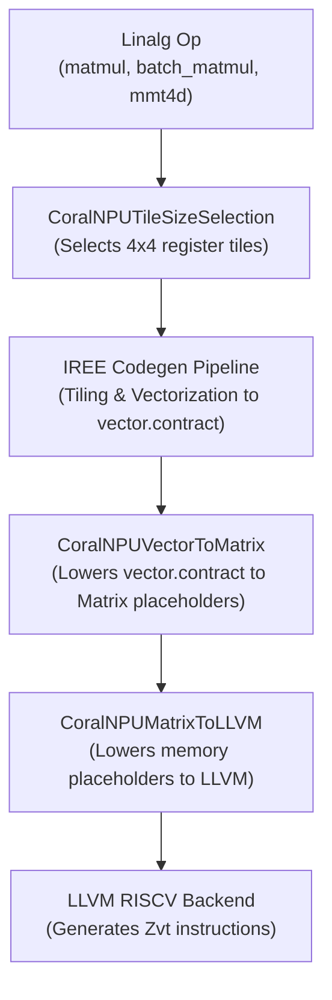

# CoralNPU Matrix Codegen Design & Implementation

This document describes the design and implementation of the direct codegen path in the CoralNPU compiler targeting the RISC-V **Zvt (Matrix)** extension.

## 1. Overview

The Zvt extension provides hardware-accelerated matrix multiplication operations on the CoralNPU. The goal of this codegen path is to lower matrix multiplication operations (`linalg.matmul`, `linalg.batch_matmul`, and `linalg.mmt4d`) directly to Zvt instructions when supported by the hardware, falling back to the standard vector (Zve) path otherwise.

For CoralNPU, the hardware matrix multiplier supports **$4 \times 4$ accumulation tiles** for FP32, BF16, and Int8 data types.

---

## 2. Compilation Pipeline

Targeting Zvt requires coordinate cooperation across multiple passes in the CoralNPU compiler:



### 2.1. CoralNPUTileSizeSelection
This pass (split into `Register` and `DTCM` levels) runs first to set the `lowering_config` on the root Linalg operation.
*   **Register Tiling**: When Zvt is enabled, the pass forces the register tile sizes to match the hardware matrix multiplier shape:
    *   $M = 4$ (Vector Align)
    *   $N = 4$ (Unroll Align)
    *   $K = 1$ (Reduction Align)
*   **Batch Loop Handling**: For `linalg.batch_matmul`, the batch dimension is classified and forced to a tile size of `1` at the register level. This ensures the vectorizer emits a 2D contraction (`vector<4x4>`) instead of a 3D contraction (`vector<Bx4x4>`), allowing it to match the Zvt hardware.

### 2.2. Vectorization (IREE Codegen)
Standard IREE passes tile the operations hierarchically and vectorize them into `vector.contract` operations matching the configuration set by `TileSizeSelection`.

### 2.3. CoralNPUVectorToMatrix
This pass runs on MLIR `FunctionOpInterface` and performs the core mapping from Vector dialect to Matrix placeholders:
1.  **Contraction Matching**: Identifies `vector.contract` operations that match the supported Matrix shapes ($4 \times 4$ register tiles, reduction size 1) and data types.
2.  **Layout-Agnostic Extraction**: Uses the contraction's `indexing_maps` to dynamically identify which dimensions correspond to $M, N,$ and $K$. This allows the pass to support various layouts (e.g. `matmul`'s $K \times N$ RHS vs `mmt4d`'s $N \times K$ RHS).
3.  **Accumulator Chain Analysis**: Performs SSA destruction. Since Matrix tile registers (`T0`-`T15`) maintain state, the pass traces the accumulator value from its initialization (constant zero or memory load) through the loop updates (`vector.contract`) to the final writeback (`vector.transfer_write`).
4.  **Rewriting**:
    *   Replaces the initialization with a `vtzero` intrinsic (for zero init) or a placeholder `coralnpu.matrix.load` call.
    *   Replaces `vector.contract` with the side-effecting `llvm.riscv.zvt.vtfmm` intrinsic (which adds to the state of the allocated tile register). The loop-carried accumulator dependency is removed.
    *   Replaces the `vector.transfer_write` with a placeholder `coralnpu.matrix.writeback` call.

### 2.4. CoralNPUMatrixToLLVM
This pass runs on `ModuleOp` after LLVM dialect conversion. It lowers the placeholder `coralnpu.matrix.load` and `coralnpu.matrix.writeback` calls to physical row-by-row memory instructions:
*   Zvt memory instructions (`vtle` / `vtse`) load or store **one row** of the tile at a time.
*   The pass generates a loop or unrolls the operation to perform 4 row-by-row loads/stores.
*   It computes the physical address for each row using pointer arithmetic based on the base pointer, tile row index, and the memory layout strides.
*   It generates the `llvm.riscv.zvt.vtle` / `llvm.riscv.zvt.vtse` intrinsics with the appropriate TSS descriptor (which encodes the target tile register and row index).

---

## 3. Supported Configurations

The following configurations are successfully lowered to Zvt:

| Linalg Operation | Input Type | Accumulator Type | Zvt Instruction | Intrinsics Used |
| :--- | :---: | :---: | :---: | :---: |
| `matmul`, `batch_matmul`, `mmt4d` | **FP32** | **FP32** | `vtfmm.tvv` | `llvm.riscv.zvt.vtfmm.tvv` |
| `matmul`, `batch_matmul`, `mmt4d` | **BF16** | **FP32** | `vtfmm.tvv` (widening) | `llvm.riscv.zvt.vtfmm.tvv` (widening) |
| `matmul`, `batch_matmul`, `mmt4d` | **Int8** | **Int32** | `vtmms.vv` | `llvm.riscv.zvt.vtmms.vv` |

### Fallbacks
*   **FP16**: Currently routed to the **Zve (vector) fallback path**. The CoralNPU simulator does not support FP16 matrix operations (`vfwcvt.f.f.v` instruction limitations), so FP16 is disabled in the Zvt path to prevent incorrect execution.
*   **Unsupported Shapes/Types**: Any operation that does not match the $4 \times 4$ shape or uses unsupported types will bypass the Zvt passes and lower to Zve vector instructions via IREE's standard pipeline.

---

## 4. Verification

Verification tests are located in `tests/models/linalg/`. You can also run end-to-end correctness tests using the verification script.

To verify the Matrix path end-to-end on the simulator, run the verification script:
```bash
# Verify FP32, BF16, and Int8 mmt4d execution on the simulator (runs all by default)
python3 scripts/verify_mmt4d_all_types.py

# Or verify a specific data type (choices: f32, f16, bf16, i8)
python3 scripts/verify_mmt4d_all_types.py --dtype f32
```
The script dynamically generates static $16 \times 16$ `mmt4d` models, compiles them (once for Zve reference and once with Zvt enabled), runs both on the CoralNPU simulator, and compares the outputs to verify numerical correctness.

